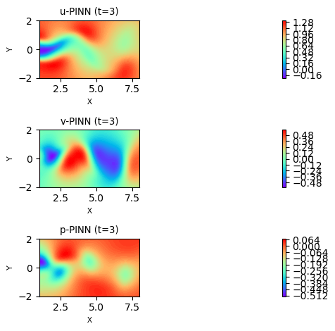
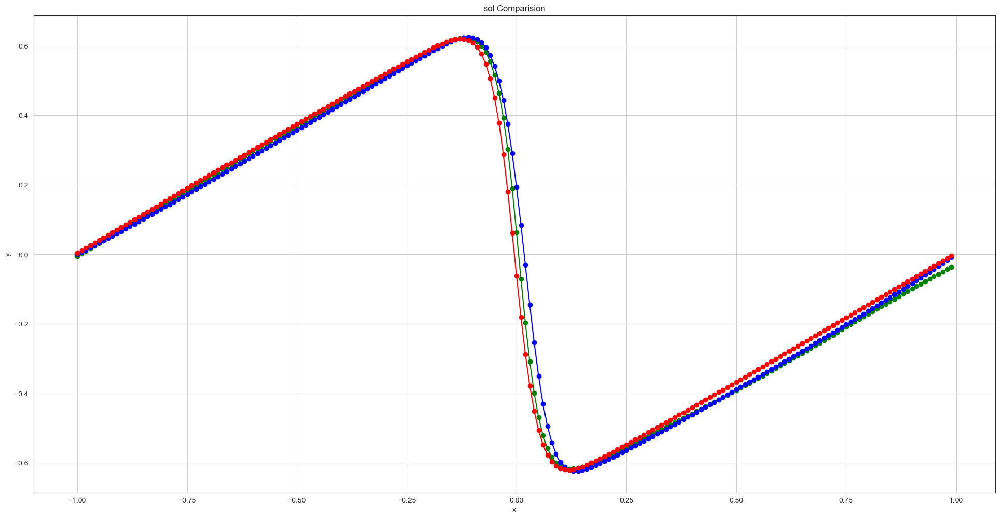
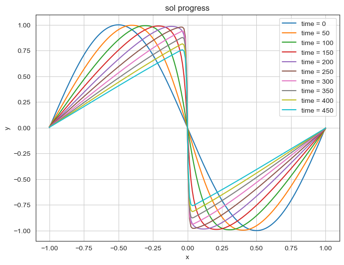

# Inverse Physics-Informed Neural Networks (I-PINNs)

**Inverse PINNs** that infer unknown PDE coefficients / hidden fields directly from sparse observations. Instead of only solving a PDE forward, the physical parameters are treated as **trainable variables** and recovered by fitting measured data while the governing equations are enforced as soft constraints. Implemented in **PyTorch** and **[DeepXDE](https://deepxde.readthedocs.io/)**.

<p align="center">
  <br>
  <em>Velocity (u, v) and pressure (p) fields reconstructed by an inverse PINN for the 2D cylinder wake.</em>
</p>

---

## The idea

Given scattered measurements of a flow/field, an inverse PINN simultaneously (1) fits a neural network to the data and (2) forces that network to obey the PDE — but with the **physical coefficients left as unknowns** that are learned alongside the network weights:

$$\min_{\theta,\ \lambda}\;\; \underbrace{\big\| u_\theta - u_{\text{data}} \big\|^2}_{\text{data misfit}} \;+\; \underbrace{\big\| \mathcal{N}_\lambda[u_\theta] \big\|^2}_{\text{PDE residual}}$$

## Problems & what is inferred

**Burgers' equation** (the `TVD` notebooks generate reference data with a total-variation-diminishing scheme; the PINN recovers the viscosity)

$$u_t + \lambda_1\,u\,u_x = \lambda_2\,u_{xx}, \qquad \text{flux } F(u)=\tfrac{1}{2}u^2$$

The reference solver uses a TVD finite-volume scheme with a **minmod** flux limiter and a predictor–corrector time step:

$$\text{minmod}(a,b)=\begin{cases}\min(a,b) & a,b>0\\\max(a,b) & a,b<0\\0 & \text{otherwise}\end{cases}$$

**Incompressible Navier–Stokes — cylinder wake** (trainable coefficients $C_1$, $C_2$; here $C_1\approx 1$ and $C_2\approx 1/\mathrm{Re}=\nu$), on the domain $1\le x\le 8$, $-2\le y\le 2$, $t\le 7$:

$$u_x + v_y = 0$$

$$u_t + C_1\,(u\,u_x + v\,u_y) = -p_x + C_2\,(u_{xx}+u_{yy})$$

$$v_t + C_1\,(u\,v_x + v\,v_y) = -p_y + C_2\,(v_{xx}+v_{yy})$$

## Projects

| Notebook | Problem | What is inferred | Framework |
|---|---|---|---|
| [`Burgers_1D_main.ipynb`](Burgers_1D_main.ipynb) | 1D Burgers' equation | Viscosity / coefficients | PyTorch |
| [`burgers_1D_BD_CD_simple.ipynb`](burgers_1D_BD_CD_simple.ipynb) | 1D Burgers' (BD/CD baseline) | Numerical reference | NumPy |
| [`TVD_main.ipynb`](TVD_main.ipynb) | Burgers' via TVD scheme | Forward reference solution | PyTorch |
| [`TVD_main_ver2.ipynb`](TVD_main_ver2.ipynb) | Burgers' via TVD scheme (v2) | Forward reference solution | PyTorch |
| [`Inverse_PINNs_TVD_main.ipynb`](Inverse_PINNs_TVD_main.ipynb) | Burgers' equation | Unknown viscosity coefficient | PyTorch |
| [`ns_IPINNS_main.ipynb`](ns_IPINNS_main.ipynb) | 2D Navier–Stokes, cylinder wake | Coefficients $C_1, C_2$ + pressure field | DeepXDE / PyTorch |

## Results

| | |
|:---:|:---:|
| <br><em>Inverse Burgers: PINN prediction vs reference</em> | <br><em>Burgers solution evolving in time (TVD reference)</em> |

## Data

- `cylinder_nektar_wake.mat` — velocity field of 2D flow past a cylinder (the classic benchmark from Raissi et al.), required by `ns_IPINNS_main.ipynb`. **Tracked with Git LFS** (~23 MB).
- `variables_main_C1_C2.dat` — recovered-coefficient history; other `*.dat` files are training/evaluation logs.

## Tech stack

Python 3.9+ · [PyTorch](https://pytorch.org/) · [DeepXDE](https://deepxde.readthedocs.io/) · NumPy · SciPy · Matplotlib

## Getting started

```bash
git clone https://github.com/erfant00001/inverse-pinns.git
cd inverse-pinns
git lfs pull          # download the .mat data file
pip install torch deepxde numpy scipy matplotlib jupyter
jupyter notebook
```

## Acknowledgements

These projects were created while learning Physics-Informed Neural Networks and Scientific Machine Learning from the Udemy courses of **Dr. Mohammad Samara** (Data Science / Machine Learning expert; PhD, University of Tokyo).

Instructor profile: **https://www.udemy.com/user/mohammad-samara-18/**

The problem setups and course material are credited to the instructor. This repository contains my own implementations and notes produced while following the courses, shared for learning and reference.
