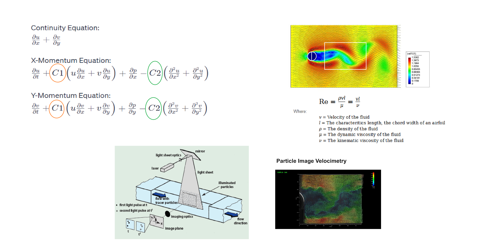
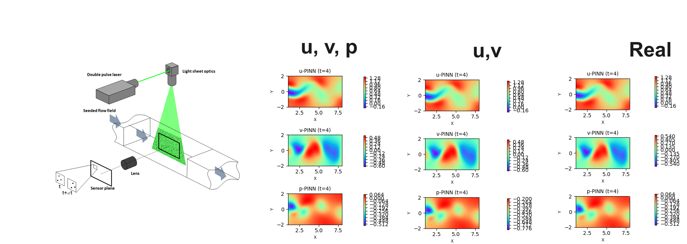

# Inverse Physics-Informed Neural Networks (I-PINNs)

**Inverse PINNs** that infer unknown PDE coefficients / hidden fields directly from sparse observations. Instead of only solving a PDE forward, these notebooks treat physical parameters (e.g. viscosity, advection/diffusion coefficients, Reynolds-number terms) as **trainable variables** and recover them by fitting measured data while enforcing the governing equations.

Implemented in **PyTorch** (from scratch) and **[DeepXDE](https://deepxde.readthedocs.io/)**.

---

## Projects

| Notebook | Problem | What is inferred | Framework |
|---|---|---|---|
| [`Burgers_1D_main.ipynb`](Burgers_1D_main.ipynb) | 1D Burgers' equation | Viscosity / equation coefficients | PyTorch |
| [`burgers_1D_BD_CD_simple.ipynb`](burgers_1D_BD_CD_simple.ipynb) | 1D Burgers' (backward/central-difference baseline) | Numerical reference | NumPy |
| [`TVD_main.ipynb`](TVD_main.ipynb) | TVD (advection–diffusion) equation | Forward solution | PyTorch |
| [`TVD_main_ver2.ipynb`](TVD_main_ver2.ipynb) | TVD equation (v2) | Forward solution | PyTorch |
| [`Inverse_PINNs_TVD_main.ipynb`](Inverse_PINNs_TVD_main.ipynb) | TVD equation | Unknown PDE coefficients | PyTorch |
| [`ns_IPINNS_main.ipynb`](ns_IPINNS_main.ipynb) | 2D Navier–Stokes, cylinder wake | Flow parameters (λ₁, λ₂) + pressure field | DeepXDE / PyTorch |

## Data

- `cylinder_nektar_wake.mat` — velocity field of 2D flow past a cylinder (the classic benchmark used by Raissi et al.), required by `ns_IPINNS_main.ipynb`. **Tracked with Git LFS** (~23 MB).
- `*.dat` — training/evaluation logs and the recovered variable history (`variables_main_C1_C2.dat`).

## Reference figures





## Tech stack

- Python 3.9+
- [PyTorch](https://pytorch.org/), [DeepXDE](https://deepxde.readthedocs.io/)
- NumPy, SciPy, Matplotlib

## Getting started

```bash
git clone https://github.com/erfant00001/inverse-pinns.git
cd inverse-pinns
git lfs pull          # download the .mat data file
pip install torch deepxde numpy scipy matplotlib jupyter
jupyter notebook
```

## Acknowledgements

These projects were created while learning Physics-Informed Neural Networks and Scientific Machine Learning from the Udemy courses of **Dr. Mohammad Samara** (Data Science / Machine Learning expert; PhD, University of Tokyo).

Instructor profile: **https://www.udemy.com/user/mohammad-samara-18/**

The problem setups and course material are credited to the instructor. This repository contains my own implementations and notes produced while following the courses, shared for learning and reference.
